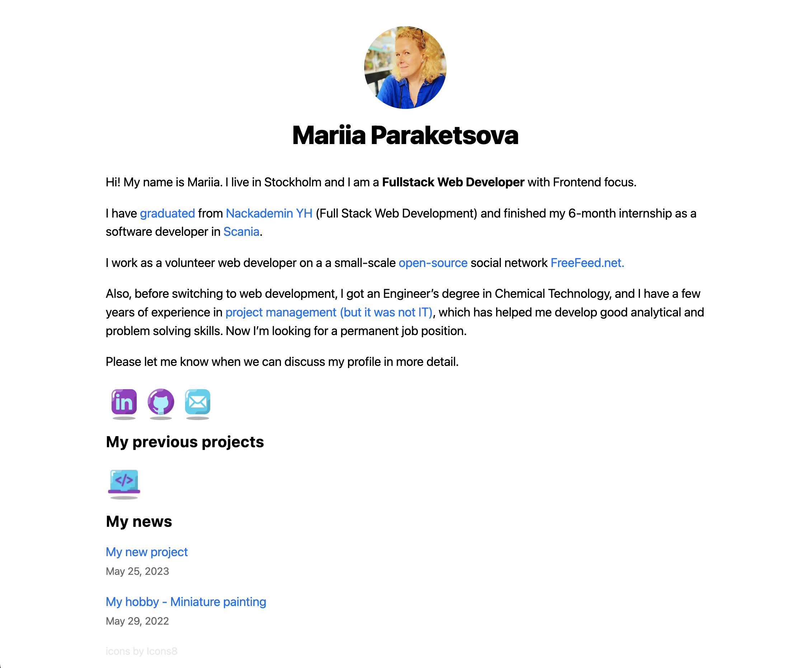

## My personal website built with Next.js - www.paraketsova.com &nbsp; &nbsp;

    

## Getting Started
To get started, just clone the repository and run `npm install && npm run dev`:

    git clone https://github.com/iaincollins/nextjs-starter.git
    npm install
    npm run dev

Note: If you are running on Windows run install --noptional flag (i.e. `npm install --no-optional`) which will skip installing fsevents.